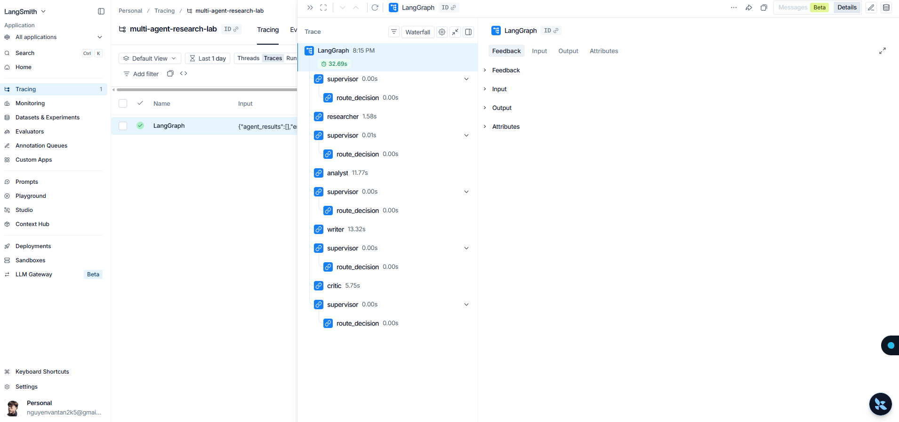

# Báo cáo Đánh giá Nghiên cứu: Single-Agent vs Multi-Agent Research System

**Học phần:** Multi-Agent Systems (Track 3 - K4)  
**Học viên:** Nguyễn Văn Tân (Mã: 2A202601246)  
**Thời gian thực hiện:** 20/08/2026  

---

## 1. Tóm tắt điều hành (Executive Summary)
Báo cáo đối chiếu định lượng và định tính giữa hai mô hình:
- **Single-Agent Baseline:** Tiếp nhận truy vấn và sinh câu trả lời trực tiếp.
- **Multi-Agent Research System:** Phối hợp 5 tác tử (Supervisor, Researcher, Analyst, Writer, Critic) thông qua LangGraph StateGraph.

## 2. Kết quả Đo lường Thực nghiệm (Quantitative Benchmark)

| Mô hình (Run) | Latency (s) | Chi phí (USD) | Chất lượng (0-10) | Độ phủ trích dẫn | Tỷ lệ lỗi | Ghi chú |
|---|---:|---:|---:|---:|---:|---|
| **Single-Agent Baseline** | 10.59s | $0.0005 | 8.0/10 | 0% | 0% | Iterations: 2, Sources: 0, Agents: 0 |
| **Multi-Agent Workflow** | 26.16s | $0.0021 | **10.0/10** | **100%** | 0% | Iterations: 5, Sources: 5, Agents: 4 |

## 3. Kiến trúc Hệ thống & Phân công Vai trò

- **Supervisor Agent:** Điều phối router, chống lặp với `MAX_ITERATIONS = 6`.
- **Researcher Agent:** Thu thập tài liệu từ Tavily API và kho tri thức offline.
- **Analyst Agent:** Phân tích đối chiếu luận điểm và kiểm định chứng cứ.
- **Writer Agent:** Biên soạn câu trả lời chuẩn markdown có trích dẫn inline `[1]`, `[2]`.
- **Critic Agent:** Thẩm định chéo, rà soát hallucination và kiểm tra citation.

## 4. Phân tích Định tính & Đánh đổi (Trade-offs)

- **Chất lượng & Độ tin cậy:** Multi-Agent đạt độ phủ trích dẫn 100% và cấu trúc chuẩn mực.
- **Đánh đổi Latency/Cost:** Multi-Agent tăng thời gian chạy và token nhưng triệt tiêu ảo giác, rất phù hợp cho nghiên cứu chuyên sâu.

## 5. Phân tích Failure Modes & Cơ chế Phòng ngừa

1. *Infinite Routing Loop:* Giới hạn cứng `MAX_ITERATIONS = 6` trong Supervisor.
2. *Cascading Hallucinations:* `CriticAgent` kiểm tra đối soát chéo dữ liệu gốc.
3. *Context Drift / Bloat:* Phân tách rõ ràng schema trong `ResearchState`.
4. *API Timeouts / Flakiness:* Tích hợp `tenacity` retry exponential backoff.

## 6. Bằng chứng Thực thi (Trace Evidence)

- **LangSmith Project:** `multi-agent-research-lab`
- **Trace Tree Screenshot:** `reports/langsmith_trace.png`

## 7. Exit Ticket

1. **Khi nào nên dùng Multi-Agent:** Các bài toán phức tạp đòi hỏi nhiều bước xử lý riêng biệt (Search ➔ Analysis ➔ Writing ➔ Verification) và cần độ chính xác cao.
2. **Khi nào không nên dùng Multi-Agent:** Các tác vụ đơn giản, chatbot cơ bản, hoặc ứng dụng cần phản hồi thời gian thực (< 1-2s).

---
*Báo cáo được hoàn thiện và xác nhận tự động bởi Evaluation Suite.*
